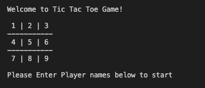

# TIC TAC TOE GAME
This is the third collaborative project from the Ruby module from the Microverse program it consists on 5 Milestones, in where we will recreate the well known Tic Tac Toe game with User Interface, Game Logic, and OOP principles, we also are going to incorporate some test driven development at the end of the project.

## 🔧 Built With

- Ruby.
- Using Rubocop Linters.
- OOP.

# Game Rules
- The Game will launch a Board on the screen
- Each player can only choose one position per turn
- You are not allowed to select a position if another player already have a mark there
- First player is the 'X'
- Second player is the 'O'
- Win when a complete line has the same symbols 'X X X' or 'O O O '
- If nobody wins after all positions have a symbol it will be a draw.

# Game Rules (Screenshots)
The Players follow the below instructions to play the game:

The Screen will display a welcome board, then Player one is the symbol 'X' and player two is the symbol 'O' From the below screen, Players can add thier names. 



A 3x3 grid is displayed on the terminal and the first player chooses a number to place his symbol on that number's position


The player which does that first wins!


The players take turns in order to try to make an uninterrupted row, column or diagonal.


If all spaces are chosen and there is no winner, it is considered a draw. 


## 🛠 Getting Started

## Install 
Besides the live demo link, you can run those functions in you own local environment. In order to run, you need to install Ruby in your computer. For windows you can go to [Ruby installer](https://rubyinstaller.org/) and for MAC and LINUX you can go to [Ruby official site](https://www.ruby-lang.org/en/downloads/) for intructions on how to intall it. Then you can clone the project by typing ```git clone https://github.com/Ceci007/Tic-Tac-Toe.git```

To get a local copy up and running follow these simple example steps.

- Go to the main page of te repo.
- Press the "Code" button and get the repo link.
- Clone it using git.

## Run the game 
Type ```bin/main.rb``` in the root file of the project. You can also type ```ruby bin/main.rb``` in the root file of the project.

## Running tests with Rspec

This game was tested with Rspec wich is a computer domain-specific language (DSL) testing tool written in programming language Ruby to test Ruby code. It is a behavior-driven development (BDD) framework which is extensively used in production applications.

## How to get Rspec running

- In the terminal, type `gem install rspec`
- Once done, go to project directory and type `rspec --init`
- You will see a folder `spec` and a file `.rspec`
- Inside spec folder you'll see a `spec_helper.rb` file.
- In the terminal, type `rspec`


# Authors
👤 Bbosa Muhamood
- Github: [@bmuhamood](https://github.com/bmuhamood)
- Twitter: [@croixtechfirm](https://twitter.com/croixtechfirm)
- Linkedin: [Bbosa Muhamood](https://www.linkedin.com/in/bbosa-muhamood-06845576/)

👤 Carlos Flores Robles
- Github: [@carlos-ssh](https://github.com/carlos-ssh)
- Twitter: [@aom.robles](https://twitter.com/aom.robles)
- Linkedin: [linkedin](https://www.linkedin.com/in/carlos-ssh/)

### 🤝 Contributing
Contributions, issues and feature requests are welcome!

Feel free to check the issues page <a href="https://github.com/carlos-ssh/tictactoe-rb/issues">Issues Pages</a>

# Show your support
Give a ⭐️ if you like this project!

### Acknowledgments
- Microverse
- Free Code Camp
- Codecademy
- GitHub
- TheOdinProject
- Ruby

## 📝 License
This project is MIT licensed.

